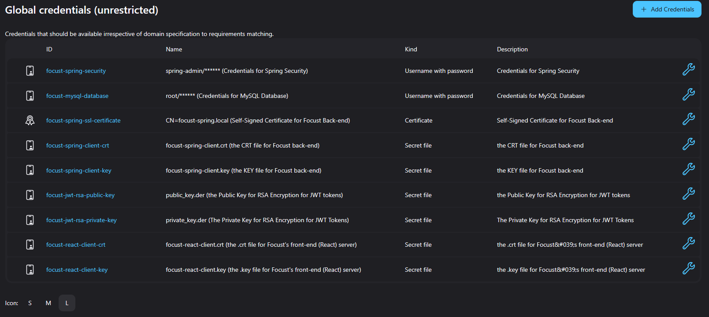
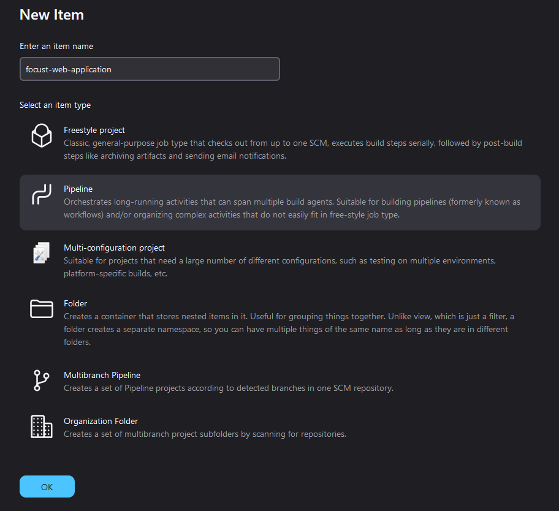

# Focust - Build from Source with Jenkins
This markdown document is used as a guide for anyone who wants to build Focust using Jenkins pipelines. 

This is the recommended approach primarily due to the fact that the `Jenkinsfile` for the project automates everything of what one might need to do when building the project via [Docker & Docker Compose](./BUILD_USING_DOCKER.md). 

## Setting Up Jenkins
Obviously, we need [*Jenkins*](https://www.jenkins.io/) installed to be able to do anything of this, as well as [*Docker*](https://www.docker.com/) ([**Docker Desktop**](https://www.docker.com/products/docker-desktop/), for those using *Windows* and want a GUI).

After going through the default installation process of Jenkins, make sure that Jenkins have at least the following plugins installed:

* [**Credentials**](https://plugins.jenkins.io/credentials/)
* [**Credentials Binding**](https://plugins.jenkins.io/credentials-binding/)
* [**Docker**](https://plugins.jenkins.io/docker-plugin/)
* [**Docker Pipeline**](https://plugins.jenkins.io/docker-workflow/)
* [**Docker Slaves**](https://plugins.jenkins.io/docker-slaves/)
* [**Git**](https://plugins.jenkins.io/git/)
* [**Pipeline**](https://plugins.jenkins.io/workflow-aggregator/)
* [**Pipeline Utility Steps**](https://plugins.jenkins.io/pipeline-utility-steps/)

If not, install them and make sure the Jenkins restarts after installing them.

The most important is to ensure than Jenkins is able to communicate with Docker at port `50000`, although the implementation of this depends on how you set up Docker and Jenkins[^1].

[^1]: The article ["Step-by-Step Guide to Setting Up Jenkins on Docker with Docker Agent-Based Builds"](https://dev.to/msrabon/step-by-step-guide-to-setting-up-jenkins-on-docker-with-docker-agent-based-builds-43j5) by *Md. Abu Raihan Srabon* to be useful if you want to run Jenkins in a Docker Container.

> [!TIP]
> If you don't have Jenkins installed, you can use my modified Jenkins Docker image, [`allandeboe/jenkins-jdk17`](https://github.com/allandeboe/jenkins-jdk17), which has all of the needed plugins installed and then some. Also, I made it be dark-mode by default, so no need to worry about the sanctity of your eyeballs when using Jenkins.

## Ensuring a Linux-based Jenkins Agent
If you already have Jenkins running on Linux and don't mind the potential security issue with [having the Built-in Node having executors](https://www.jenkins.io/doc/book/managing/nodes/), then you can skip to the next section.

The recommend approach is to create a Linux-based Jenkins slave. You can create a docker container hosting the slave, and you reference [this page](https://www.jenkins.io/doc/book/using/using-agents/#creating-your-docker-agent) if you need a guide on how to do that. 

> [!IMPORTANT]
> I recommend adding `-p 50000:50000` to the command to create the agent container as one would need for the Jenkins master, as it will allow the agent to communicate with Docker. 

## Adding Necessary Credentials
Before actually creating a job that will build the application, it is actually rather important to create the needed credentials that the `Jenkinsfile` needs to 

The first two credentials needed are **username & password** credentials with the following IDs:

* `focust-spring-security` - for Spring Security
* `focust-mysql-database` - for MySQL Database

The next credential needed is an **certificate** credential, where you upload an appropriate `PKCS12` *SSL Certificate*:

* `focust-spring-ssl-certificate` - to enable HTTPS for the Spring Application; `focust-spring` and `focust-spring.p12` are the values for *alias* and the *keystore*, respectively.

The final 6 credentials needed are **Secret File** credentials, where you upload both the generated `.crt` and `.key` files of the `focust-spring.p12` (i.e. `focust-spring-client.crt` and `focust-spring-client.key`), the RSA public and private key files (i.e. `public_key.der` and `private_key.der`) used to sign and verify JWT tokens, and a single `.pem` file containing the certificate and private key for the react front-end (i.e. `focust-react.pem`), which one can generate by first creating `.crt` and `.key` files from `focust-react.p12` and put the data in both into a single `.pem` file.

* `focust-spring-client-crt` - the `focust-spring-client.crt` file.
* `focust-spring-client-key` - the `focust-spring-client.key` file.
* `focust-jwt-rsa-public-key` - the `public_key.der` file.
* `focust-jwt-rsa-private-key` - the `private_key.der` file.
* `focust-react-pem` - the `focust-react.pem` file.

In the end, you should have the following 8 credentials under *Manage Jenkins* > *Credentials*:

To create Credentials in Jenkins, please refer to [this page](https://www.jenkins.io/doc/book/using/using-credentials/) on the Jenkins website.

## Creating Pipeline Job
To build the application using Jenkins, we will need to create a new job. more specific, a *Pipeline job*, as we already have a `Jenkinsfile` than governs how the project should be built.

On the Jenkins Dashboard, there should be an option to create a new job. Press that, and then write down the name of the job (here, I wrote `focust-web-application`) and selected **Pipeline** for item type, as shown:

After pressing "OK", you will be met with the second page. Scroll all the way down to the bottom where you should see **Pipeline**. Now, select "Pipeline script from SCM" for Definition, select "Git" for the SCM, and, under **Repositories**, finally put in the link to the GitHub of the project (or your fork of it) for the "Repository URL".

> [!IMPORTANT]
> if you have a private fork of the project, you will need to replace the repository url to `https://[ACCESS_TOKEN]@github.com/[USERNAME]/[FORKED_REPO].git`, where `[ACCESS_TOKEN]` is the Fine-grained Personal Access Token that you will get from GitHub when creating a new token under [*Settings*](https://github.com/settings/profile) > *Developer Settings* > *Personal Access Tokens* > *Fine-grained Tokens* on GitHub.

It should look something like this:

Now, all you have to do is press "Save" and you should finally have the job available on the Jenkins dashboard.

## Running the Build
Once back on the dashboard, all you have to do is press the Green arrow on the job and, if all goes well, the Jenkins job should have a green checkmark next to it after refreshing the page once the build is completed.